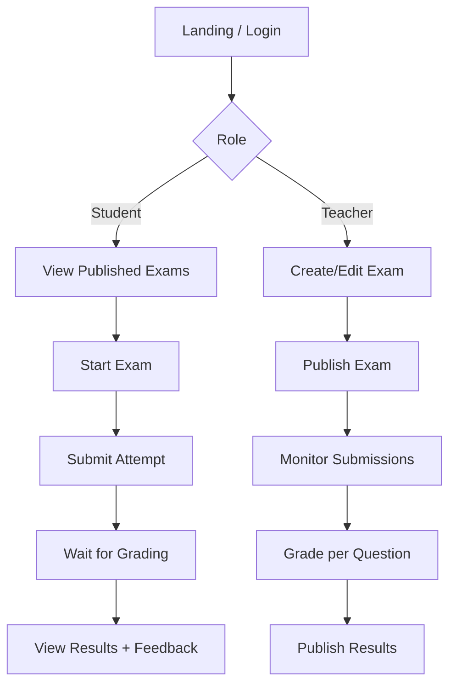
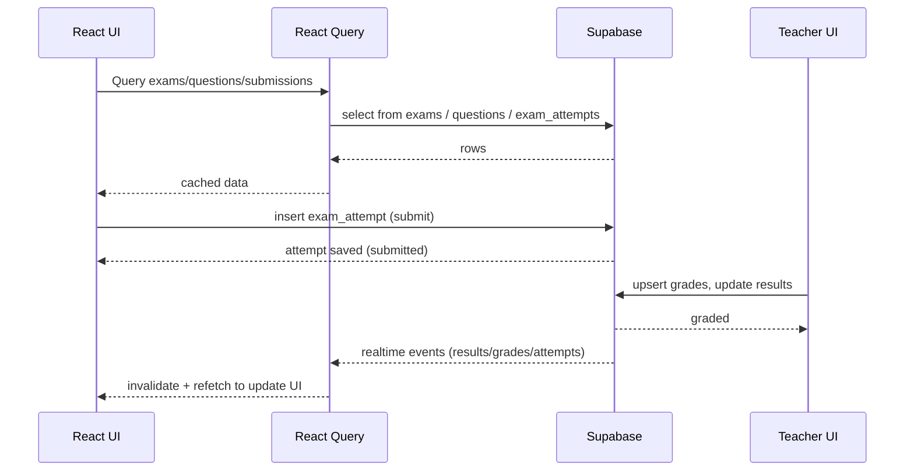

# Examify – Online Examination System

Live App: https://examif1.vercel.app/

Author: [YOUR NAME]

Examify is a modern, cloud-backed web app for creating, taking, and grading exams. It provides role-based experiences for students and teachers, real-time updates, and a polished UI built with React, TypeScript, and Tailwind.


## Features

- Authentication and roles (student/teacher) via Supabase Auth
- Teacher tools: create exams, add questions, publish/archive, review submissions, grade
- Student tools: take exams, submit answers, view graded results and feedback
- Real-time results updates (Supabase Realtime + React Query cache invalidation)
- Clean UI built on shadcn-ui and Radix primitives
- Reliable server-state management with React Query


## Tech stack

- Frontend: React 18 + TypeScript, Vite, React Router
- UI: Tailwind CSS, shadcn-ui, Radix UI, lucide-react
- Data and Auth: Supabase (Database, Auth, Realtime)
- Data fetching/state: @tanstack/react-query
- Forms and validation: React Hook Form + Zod
- Tooling: ESLint, PostCSS
- Deployment: Vercel


## How it works (high level)

- Auth and Roles
  - Supabase Auth manages sign-up/sign-in and sessions.
  - Roles are stored in `user_roles` (e.g., `student`, `teacher`) and used to control UI access and data visibility.

- Core Entities (tables)
  - `exams`: exam metadata (title, subject, status, total marks, created_by, created_at)
  - `questions`: question bank (text, type, options, correct_answer, points, created_by)
  - `exam_questions`: mapping that orders questions per exam (`order_number`)
  - `exam_attempts`: a student’s attempt with `answers`, `time_taken`, `status` (draft/submitted/in_review/graded), `total_score`
  - `grades`: per-question grading records (score/max_score, grader, timestamps)
  - `submissions` and `results`: maintained for backward compatibility and user-facing feedback
  - `profiles`: basic user profile info (e.g., `full_name`)

- Teacher flow
  1. Create exam in UI (writes to `exams`).
  2. Add/select questions (writes to `exam_questions`).
  3. Publish exam (update `exams.status`).
  4. Review submissions (`exam_attempts`) and grade per-question to `grades`.
  5. Overall scores and optional feedback are reflected in `results` for history/compatibility.

- Student flow
  1. Authenticate; role detected from `user_roles`.
  2. Start exam; attempt tracked in `exam_attempts`.
  3. Submit answers; attempt transitions to `submitted`.
  4. After grading, result appears in real time (React Query + Supabase Realtime).

- Data fetching and realtime
  - All reads/writes go through Supabase via `@supabase/supabase-js`.
  - React Query handles caching/invalidation; hooks like `useExams`, `useQuestions`, `useSubmissions`, `useGrading`, `useResults` abstract queries/mutations.
  - `useResults` subscribes to Supabase channels for instant UI updates.


## Run locally

Prerequisites
- Node.js 18+ and npm
- Supabase project (URL + anon/public key) with Auth enabled

Environment variables
Create a `.env` file at the project root with at least:

```
VITE_SUPABASE_URL=your_supabase_url
VITE_SUPABASE_PUBLISHABLE_KEY=your_supabase_anon_or_public_key
```

Install and start

```
# Clone your repo
git clone <YOUR_GIT_URL>
cd <YOUR_PROJECT_FOLDER>

# Install deps
npm install

# Start dev server (Vite)
npm run dev
# The app runs at http://localhost:8080 (see vite.config.ts)
```

Useful scripts

```
# Lint
npm run lint

# Production build
npm run build

# Preview the production build
npm run preview
```

Notes
- Ensure your Supabase tables and RLS policies align with the entities listed above.
- If you already have `.env` locally, do not commit secrets.


## Project structure (excerpt)

```
src/
  components/
    auth/              # Login/Register, ProtectedRoute
    dashboard/         # StudentDashboard, TeacherDashboard
    exam/              # ExamCreator, ExamInterface, ExamView, ErrorBoundary
    grading/           # GradingInterface
    results/           # ResultsView
    ui/                # shadcn-ui components
  hooks/
    useAuth.tsx
    useExams.tsx
    useQuestions.tsx
    useSubmissions.tsx
    useSubmittedExams.tsx
    useGrading.tsx
    useResults.tsx
  integrations/
    supabase/
      client.ts        # Supabase client (reads VITE_* envs)
      types.ts         # DB types
  pages/               # Routes (Login, Index, Auth, Logout, NotFound)
  main.tsx            # App bootstrap
```


## Methodologies and architecture

- Component-driven development with clear feature folders
- Type-safe, form-first UX with React Hook Form + Zod
- Role-Based Access Control (RBAC) enforced in UI and queries
- Server-state caching and optimistic UX via React Query
- Realtime invalidation and updates via Supabase channels
- Error boundaries for resilient rendering
- Build-time opt with Vite + SWC React plugin


## Deployment (Vercel)

1. Push the repo to GitHub.
2. Import the project in Vercel and select the root directory.
3. Add the same environment variables:
   - `VITE_SUPABASE_URL`
   - `VITE_SUPABASE_PUBLISHABLE_KEY`
4. Build command: `npm run build` (default). Output: `dist`.
5. Deploy; your production URL will be available and can match the live app above.


## Design and working flow

High-level user flow



Data flow overview



---

Questions or a name update for the Author line? Tell me the exact name to credit and I’ll update this file accordingly.
